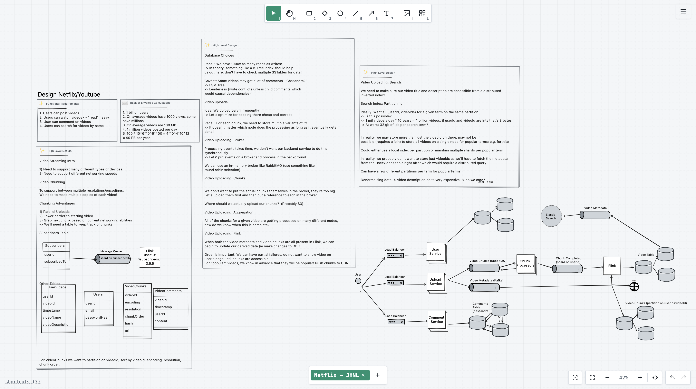

# ArchiDraw

Drawing canvas for **software architecture and system design** — Excalidraw/draw.io style, but with domain intelligence: ready-to-use components (APIs, queues, databases, caches, CDNs) and standardized notation. Draw architecture at the speed of thought.




## Objective

Generic drawing tools require too much manual work: searching for icons, aligning elements, maintaining consistency. ArchiDraw is built for **software engineers and architects** who need speed when creating technical proposals, RFCs/ADRs, documentation, and preparing for system design interviews — running **100% locally**, with no accounts, no cloud dependencies, and no recurring costs.


## Key Features

- **Infinite canvas** with pan, zoom, snapping, and smart alignment guides
- **Shapes and connections:** rectangle, ellipse, diamond, arrows (straight, elbow, curved), free text, and inline text
- **Software component library:** API Gateway, Load Balancer, Service, Database, Cache, Message Queue, CDN, Lambda, and more
- **AWS and Kubernetes icons** (official libraries)
- **Editable edge labels:** inline text, movable along the path, with drag handles
- **Hover info box:** technical details (payload, latency, notes) hidden by default
- **Multiple canvas tabs** per workspace
- **Undo/Redo, multi-selection, layers, align/distribute, copy/paste/duplicate**
- **Logical grouping** (⌘/Ctrl+G)
- **Full keyboard shortcuts**
- **Automatic persistence** via localStorage — no "save" button required
- **Excalidraw compatible:** import existing `.excalidraw` diagrams and `.excalidrawlib` component libraries directly
- **Export options:** PNG, SVG, and portable JSON (`.archidraw`)
- **Dark mode and additional skins** (midnight, blueprint, warm, swiss)
- **Total privacy:** data never leaves your machine


## How to Use

### Docker (Recommended)

Run the official image from Docker Hub:

```bash
docker run -d --name archidraw -p 5000:5000 alissonpdc/archidraw:latest
```

Access **http://localhost:5000**.

The host port is configurable via `-p` (e.g., `-p 8080:5000` exposes it on port 8080).

To stop and restart the app:

```bash
docker stop archidraw
docker start archidraw
```

### Basic Workflow

1. Open the app and draw on the canvas: `R` rectangle, `T` text, `V` select, `H` hand (pan).
2. Add components from the software architecture library and AWS/Kubernetes icons.
3. Add technical details via the hover info boxes.
4. Everything is saved automatically in the browser. Use JSON export/import for backups or moving between instances.


## License

[Apache-2.0](LICENSE)