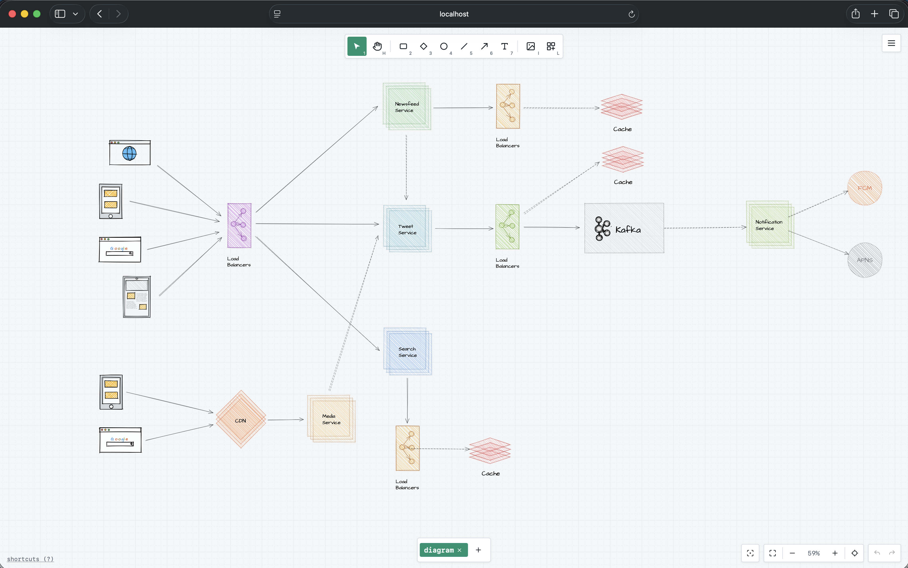

<div align="center">


# ArchiDraw

**Hand-drawn style architecture diagram editor that runs entirely in your browser.**

[](https://github.com/alissonpdc/archidraw/actions)
[](https://nodejs.org/)
[](https://www.typescriptlang.org)
[](LICENSE)

</div>

ArchiDraw is a client-side canvas app for drawing [software architecture diagrams](https://en.wikipedia.org/wiki/Architecture_diagram) with a hand-sketched look. It ships with built-in AWS and Kubernetes component libraries, smart arrow binding, and multi-tab workspaces — with no backend, sign-up, or data leaving your machine.



## Features

- **Sketch-style rendering** — clean to hand-drawn shapes via *roughness*, with hachure/cross-hachure fills and dashed/dotted/dash-dot strokes.
- **Architecture component library** — a built-in catalog of AWS and Kubernetes icons organized by *Compute, Network, Database, Storage, Messaging, Security*, and *Monitoring*.
- **Custom library** — save any selection as a reusable component and re-insert it as an editable native group; import `.excalidrawlib` libraries and export your own as `.archidrawlib`.
- **Smart edges** — arrows and lines snap and bind to shape outlines (with subtle center locking), support orthogonal auto-routing, curved mode, bend points, segment dragging, and draggable edge labels. Optionally animate dashed edges to show data flow.
- **Rich text & labels** — in-place text editing with fonts, bold/italic/underline, alignment, and per-element text color.
- **Multi-tab workspaces** — several diagrams per workspace with per-tab undo/redo, renaming and reordering.
- **Layout tools** — grouping, layer ordering, alignment and distribution of multi-selections, marquee selection, duplicate, and clipboard (including pasted images).
- **Focus mode** — hide all UI chrome and draw distraction-free.
- **Theming** — light/dark/system themes, four *skins* (Midnight, Blueprint, Warm, Ink), dot/line-grid and background colors.
- **No cloud** — autosaved to `localStorage`, importable/exportable as JSON files.

> [!TIP]
> ArchiDraw is compatible with [Excalidraw](https://excalidraw.com/) files (`.excalidraw`) and libraries (`.excalidrawlib`).

## Getting started

### With Docker (recommended)

```bash
make run-container
```

Open `http://localhost:5000` and start drawing — no local toolchain needed.

### From source

Requirements: **Node.js 22+**, npm, and Docker (optional).

```bash
git clone https://github.com/alissonpdc/archidraw.git && cd archidraw
make install
make run
```

Open `http://localhost:5173` and start drawing.

## Usage

The toolbar holds the drawing tools: selection, hand, rectangle, diamond, ellipse, line, arrow, and text. Open the component library with `L`; drag or click an item to place it on the canvas.

| Shortcut | Action |
|---|---|
| `1`–`7` | Select drawing tool (selection, hand, rect, diamond, ellipse, line, arrow, text) |
| `Shift` | 45° angle snapping / perfect shapes while drawing |
| `Space` / middle-click | Pan |
| `⌘/Ctrl + scroll` | Zoom |
| `Shift + 1` | Zoom to fit |
| `⌘/Ctrl + G`/`⇧G` | Group / ungroup |
| `⌘/Ctrl + D` | Duplicate |
| `⌘/Ctrl + Z` / `⇧Z` or `Y` | Undo / redo |
| `⌘/Ctrl + O` / `S` | Open / save file |
| `?` | Shortcut reference |

Double-click an element to edit its label or text; double-click empty canvas to create free text.

## File formats

| Format | Description |
|---|---|
| `.archidraw` | ArchiDraw diagram or workspace (single tab or all tabs), openable via `Open` |
| `.excalidraw` | Import [Excalidraw](https://excalidraw.com/) scene files |
| `.excalidrawlib` / `.archidrawlib` | Import into the component library; export your *Custom* library |
| `PNG` / `SVG` | Export the active diagram as an image |
| `image/*` | Insert/paste raster images (embedded as assets) |

## How it works

ArchiDraw is a **pure frontend** app. There is no server component: the diagram state lives in a framework-free `Editor` state machine and is rendered on a Canvas 2D surface.

```
┌──────────────────────────────────────────────────────┐
│  src/ui · thin React shell, presents state only      │
├──────────────────────────────────────────────────────┤
│  src/core · pure logic: document model (types),      │
│  Editor state machine, renderer, history, hit-test   │
│  storage, exporter, library, rough-path generation   │
└──────────────────────────────────────────────────────┘
```

- **`src/core/`** — framework-free logic: the document model, the `Editor` class, the Canvas 2D renderer, deterministic rough-path geometry, undo/redo history, hit-testing, storage/persistence, and the library & import/export pipelines.
- **`src/ui/`** — a thin React 19 presentation shell. UI subscribes to the editor via `useSyncExternalStore`; all state and interaction logic lives in `src/core`.

Rough ("hand-drawn") shapes are generated deterministically from a per-element seed, so a diagram re-renders identically on screen, in exported SVG, and later — a key property for reproducible exports.

> [!NOTE]
> Drawing is intentionally *not* pixels: ArchiDraw renders crisp Canvas 2D vectors, so exports stay sharp at any zoom.

## Development

```bash
make run          # start the Vite dev server
make build        # typecheck (tsc -b) + production build
make lint         # oxlint
make test         # Playwright tests against a real preview build
make gate         # lint + build + test (full verification)
```

Run `make help` to see all available targets.

### Testing

Verification is **E2E-only** (Playwright, single worker); there are no unit tests. A test build exposes the editor internals so specs can assert on the document state directly, and any `console.error`/`console.warning`/`pageerror` fails the suite.

```bash
make test                          # full suite
make build && npx playwright test e2e/specs/history.spec.ts  # single spec
```

### CI and releases

Pushing a branch with a conventional prefix (`feat/`, `fix/`, `chore/`, …) triggers CI — lint, typecheck, security audit, E2E tests, and build — and opens a PR to `main` automatically when green. Merging a PR to `main` releases: an automatic semver bump is derived from the commit history (`feat` → minor, breaking change → major, else patch), a GitHub Release is created, and a multi-arch Docker image is published to Docker Hub.

See [`CONTRIBUTING.md`](CONTRIBUTING.md) for the full contribution and release flow.

## Docker

A multi-stage `Dockerfile` serves the production build with nginx:

```bash
make container
docker run --rm -p 5000:5000 archidraw
```

The image is the same one pushed to Docker Hub on every release (tags `X.Y.Z`, `X.Y`, and `latest`).